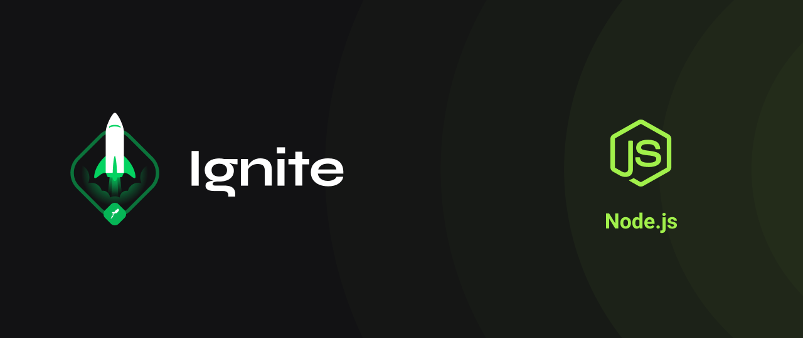

<div align="center" id="top"> 
  

&#xa0;

  <!-- <a href="https://desafio.netlify.com">Demo</a> -->
</div>

<h1 align="center">Desafio</h1>

<p align="center">
  

  

  

  

  <!--  -->

  <!--  -->

  <!--  -->
</p>

<!-- Status -->

<!-- <h4 align="center">
	🚧  Desafio 🚀 Em construção...  🚧
</h4>

<hr> -->

<p align="center">
  <a href="#laptop-sobre-o-desafio">Sobre o desafio</a> &#xa0; | &#xa0; 
  <a href="#sparkles-funcionalidades">Funcionalidades</a> &#xa0; | &#xa0;
  <a href="#rocket-tecnologias">Tecnologias</a> &#xa0; | &#xa0;
  <a href="#white_check_mark-pré-requisitos">Pré requisitos</a> &#xa0; | &#xa0;
  <a href="#checkered_flag-começando">Começando</a> &#xa0; | &#xa0;
  <a href="#memo-licença">Licença</a> &#xa0; | &#xa0;
  <a href="https://github.com/thiilins" target="_blank">Autor</a>
</p>
<br>

# :computer: Sobre o desafio

Nesse desafio, você deverá criar uma aplicação para treinar o que aprendeu até agora no Node.js!
Essa será uma aplicação para gerenciar tarefas (em inglês _todos_).Será permitida a criação de um usuário com `name` e `username`, bem como fazer o CRUD de *todos*

## :sparkles: Funcionalidades

- [x] Criar um novo _todo_;
- [x] Listar todos os _todos_;
- [x] Alterar o `title` e `deadline` de um _todo_ existente;
- [x] Marcar um _todo_ como feito;
- [x] Excluir um _todo_;

Tudo isso para cada usuário em específico (o `username` será passado pelo header). A seguir veremos com mais detalhes o que e como precisa ser feito 🚀

## :rocket: Tecnologias

As seguintes ferramentas foram usadas na construção do projeto:

- [Node.js](https://nodejs.org/en/)

## :white_check_mark: Pré requisitos

Antes de começar :checkered_flag:, você precisa ter o [Git](https://git-scm.com) e o [Node](https://nodejs.org/en/) instalados em sua maquina.

## :checkered_flag: Começando

```bash
# Clone este repositório
$ git clone https://github.com/thiilins/ignite-conceitos-do-nodejs

# Entre na pasta
$ cd desafio

# Instale as dependências
$ yarn

# Para iniciar o projeto
$ yarn start

# O app vai inicializar em <http://localhost:3000>
```

## :memo: Licença

Este projeto está sob licença MIT. Veja o arquivo [LICENSE](LICENSE.md) para mais detalhes.

Feito com :heart: por <a href="https://github.com/thiilins" target="_blank">Thiago Lins</a>

&#xa0;

<a href="#top">Voltar para o topo</a>
